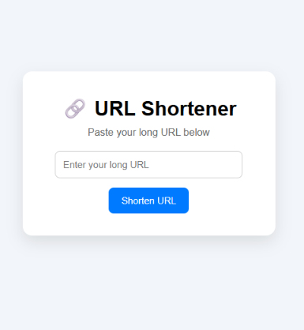
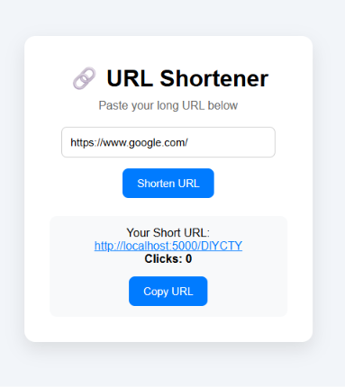
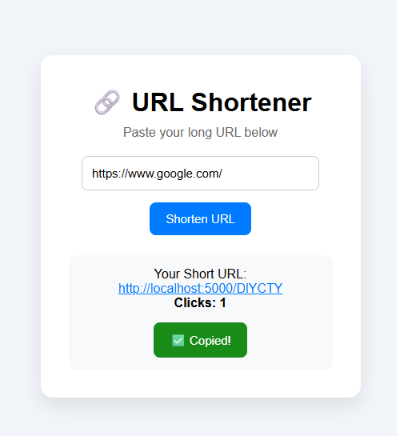
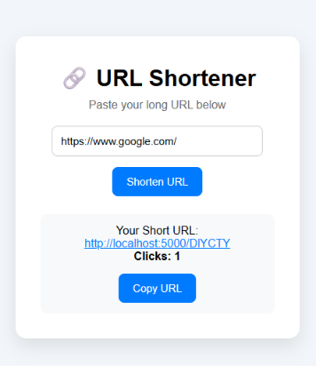

# 🔗 URL Shortener

A full-stack URL Shortener web application built with **React** and **Flask**. It allows users to convert long URLs into short links, redirect to the original website, track the number of clicks, and copy the shortened URL with a single click.

---

## Features

- Shorten long URLs instantly
- Redirect short URLs to the original website
- Track click count
- Copy shortened URL to clipboard
- Modern and responsive user interface

---

## Technologies Used

### Frontend

- React
- CSS
- JavaScript
- Vite

### Backend

- Flask
- SQLite

---

## Project Structure

```
url-shortener/
│
├── frontend/
│   ├── src/
│   ├── public/
│   └── package.json
│
├── backend/
│   ├── app.py
│   ├── urls.db
│   └── requirements.txt
│
└── README.md
```

---

## Installation

### Clone the repository

```bash
git clone <your-repository-link>
```

### Frontend

```bash
cd frontend
npm install
npm run dev
```

### Backend

```bash
cd backend
pip install -r requirements.txt
python app.py
```

## Live Demo

Frontend:
https://url-shortener-gamma-puce.vercel.app

Backend:
https://url-shortener-backend-omgk.onrender.com

---

## Screenshots

### Home Page



---

### Short URL Generated



---

### Copy URL



---

### Click Counter


---

## Author

**Vishakha Chavan**
